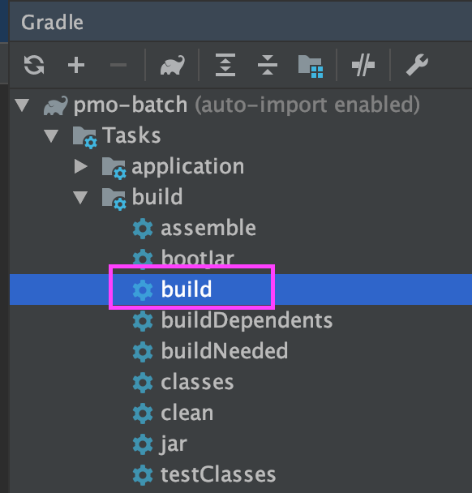
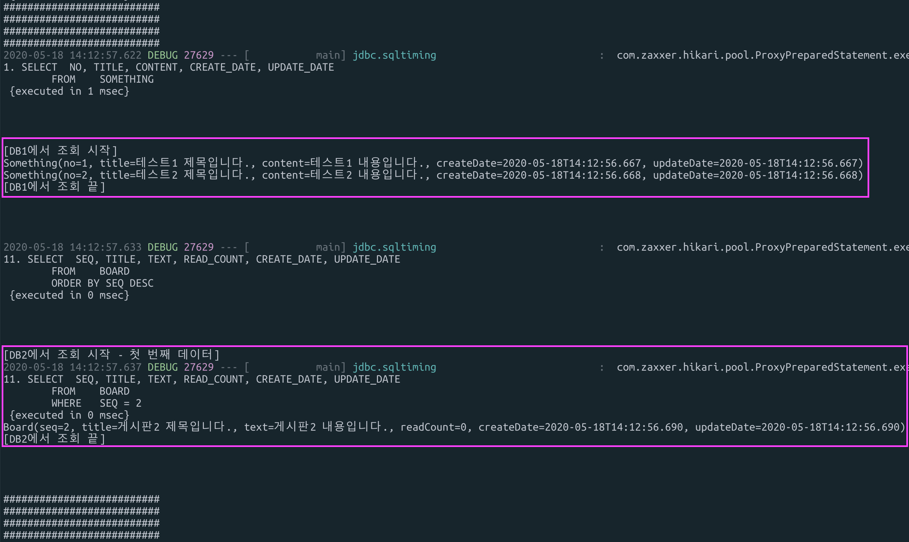

# 풀무원 배치 프로젝트 

## 기술 스택
* Spring Boot 2.2.4
* MyBatis
* Lombok
* Gradle
* JUnit 5
* Logback

## Database Configuration
1. DB Connection을 준비 했습니다.  
    1. `MasterDatabase(Primary)`, `SlaveEonDataBase`  
    2. 설정 파일은 아래 위치에 있습니다.  
        ```
        com.pulmuone.batch.common.config.database.*
        ```
2. 테스트를 위해 기본 구동 환경은 `local`로 설정 되었습니다.   
    1. application.yml  
        ```yaml
        spring.profile.active: local
        ```  
    2. 어플리케이션 구동시 MySql Database가 선택됩니다.  
    3. 초기 구동에 필요한 테이블과 데이터  
        1. MasterDataBase  
            * /scripts/ddl
            `st-batch-job.sql, st-batch-job-execution.sql`,
            `st-batch-job-sample.sql`
            * /scripts/dml`st-batch-job-data.sql, st-batch-job-sample-data.sql`  
 

## 배치 어플리케이션 관리용 DB Table

### 배치 목록 관리 테이블
* 테이블명: `BATCH_JOB`
* 배치 구동시 반드시 필요한 BATCH_NO를 관리합니다.  

| 컬럼명 | 설명 |
| :----- | :----- |
|  BATCH_NO  |  배치번호  |
|  BATCH_NAME  |  배치명  |
|  DESCRIPTION  |  설명  |
|  JOB_CLASS_FULL_PATH  |  배치 어플리케이션(BaseJob의 구현체) class 위치  |
|  USE_YN  |  사용 여부  |
|  CREATE_DATE  |  등록일  |
|  SCHEDULE  |  실행스케쥴(참고용)  |


### 배치 실행내역 관리 테이블
* 테이블명: `BATCH_JOB_EXECUTION`
* 배치의 실행 내역과 결과를 등록합니다.
* 배치 상태기 `실행중`이면 중복실행이 불가합니다.

| 컬럼명 | 설명 |
| :----- | :----- |
|  JOB_EXECUTION_ID  |  배치실행번호  |
|  BATCH_NO  |  배치번호(BATCH_JOB 테이블)  |
|  START_TIME  |  배치 실행 시간  |
|  END_TIME  |  배치 종료 시간  |
|  STATUS  |  배치 상태 (`BatchStatus`) - STARETED, FAILED, COMPLETED |
|  ERROR_MSG  |  오류 메시지  |
|  BUILD_USER_ID  |  배치 실행 유저 아이디  |


## 테스트 배치 어플리케이션 구동 방법
> java -jar {jar 파일} {배치번호} {실행 user}

### 어플리케이션 빌드
#### 방법1. gradle command

```bash
$ ./gradlew clean build
```
    
#### 방법2. IDEA의 gradle task 실행



### jar 실행
#### 테스트용 배치 어플리케이션  

|  항목 | 값 |
| :-----  | :----- |
| 배치번호 | 1 |
| Class | `SampleJob` |
| 내용 | 1. MasterDataBase(Primary) connection을 통해서 ST_BATCH_JOB_SAMPLE 테이블의 목록을 조회합니다.  |
|  

```bash
$ java -jar ./build/libs/pulmuone-batch.jar 1
```

##### 실행 결과


## 신규 Job 생성 
### Class path
* Job class : kr.co.pulmuone.batch.application.job
* Service : kr.co.pulmuone.batch.domain.service (exclude job biz) 
* Vo or DTO : kr.co.pulmuone.batch.domain.model (exclude job biz)

* Mapper :  
MasterDataBase `MastarDatabaseConfig.java: basePackages`  
SlaveEonDataBase `SlaveEonDatabaseConfig.java: basePackages`
* 구현은 Common module
biz: kr.co.pulmuone.v1.batch
mapper: kr.co.pulmuone.v1.comm.mappers.batch
mapper.xml: resources/mappers/batch

### MyBatis xml
* config file  
MasterDataBase: `mybatis-config-master.xml`  
SlaveEonDataBase: `mybatis-config-slave-eon.xml`

### Exception
* 에러 처리를 DB에 저장시
* Custom Exception 처리시 Job 클래스 에서 예외를 부모 클래스로 전달 
* try catch 사용시 부모로 전달해야 할 경우 throw new

### Transaction Annotation
* Batch System 객체가 기본적으로 Master DB를 사용
* @Transactional(propagation = Propagation.REQUIRES_NEW, readOnly = false)


